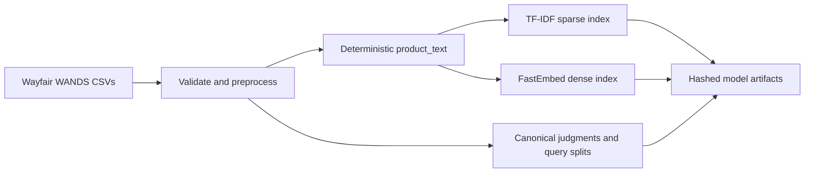
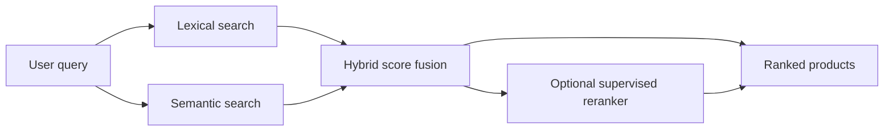
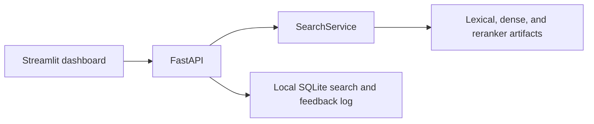

# Semantic Product Search Engine

[](https://github.com/vijaypratap3364/semantic-product-search-engine/actions/workflows/ci.yml)
[](https://www.python.org/downloads/release/python-3120/)
[](#dataset-attribution)

A CPU-friendly, end-to-end product search system built on Wayfair's WANDS relevance dataset. It compares TF-IDF lexical retrieval, FastEmbed dense retrieval, validation-tuned hybrid fusion, and a lightweight supervised reranker through one leakage-controlled evaluation framework, then serves the selected engine through a reusable Python service, FastAPI, and Streamlit with local SQLite feedback.

## Problem statement

Given a free-form shopping query, rank the most useful catalog products near the top. The system must work for exact catalog terminology and meaning-based queries, remain reproducible on ordinary hardware, and support honest comparison against human relevance judgments.

## Why product search is difficult

- Shoppers and catalogs often use different words for the same intent.
- Short, ambiguous queries provide little context about product type or attributes.
- Exact terms matter for brands, materials, dimensions, and other constraints.
- Relevance is graded: a product can be an exact, partial, or irrelevant match.
- Most catalog products are unjudged, so an unjudged result cannot safely be called irrelevant.
- Offline improvements must generalize to unseen queries without leaking test judgments.

## Architecture

### Offline indexing



### Online search



### Application



Static indexes and models load once at service startup. Search responses contain compact product metadata, component scores when applicable, and deterministic evidence such as matched title terms—never LLM-generated explanations.

## Search approaches

| Approach | Implementation | Role |
|---|---|---|
| Lexical | Word unigram/bigram `TfidfVectorizer`, sparse cosine similarity | Strong exact-term baseline |
| Semantic | `BAAI/bge-small-en-v1.5`, 384-dimensional normalized embeddings, exact NumPy scoring | Meaning-based matching with low lexical overlap |
| Hybrid | Per-query min-max score normalization with frozen weights: 0.1 lexical, 0.9 semantic | Combines complementary lexical and semantic evidence |
| Reranked hybrid | Three-class multinomial logistic regression over 13 query-product features | Reorders the hybrid top-100 candidate set by expected graded relevance |

The reranker score is exactly `P(Partial) * 1 + P(Exact) * 2`. It never retrieves products outside the hybrid candidate pool.

## Dataset

The project downloads only `product.csv`, `query.csv`, and `label.csv` from the official [Wayfair WANDS repository](https://github.com/wayfair/WANDS). The verified local preparation contains:

- 42,994 catalog products
- 480 unique queries
- 233,448 source judgment rows
- 231,873 canonical query-product judgments after deterministic duplicate resolution
- 336 train, 72 validation, and 72 held-out test queries

Indexed `product_text` is built from catalog fields that are available at search time: product name, class, category hierarchy, description, and features. Source labels are preserved separately from the canonical one-row-per-pair evaluation table. See [docs/data-source.md](docs/data-source.md) for schemas, hashes, duplicate analysis, preprocessing, and limitations.

## Evaluation methodology

Query IDs are split 70%/15%/15% using seed 42, ensuring that one query never appears in more than one split. Training labels fit the reranker, validation queries select fusion weights and reranker eligibility, and the test split is opened once for the frozen final comparison.

The primary benchmark is judged-candidate evaluation, where every ranked candidate has a human label. It reports graded nDCG and binary Precision, Recall, and MRR, treating Exact and Partial as relevant. Full-catalog evaluation separately measures recovery of known relevant products; unjudged products remain unknown rather than being assumed irrelevant. See [docs/evaluation.md](docs/evaluation.md) and the [search model card](docs/search-model-card.md).

## Verified results

The following frozen held-out results come from 72 test queries in `artifacts/reports/final_test_metrics.json`. No retrieval parameters were changed after test evaluation.

| System | nDCG@5 | nDCG@10 | Precision@5 | Precision@10 | Recall@5 | Recall@10 | MRR@10 |
|---|---:|---:|---:|---:|---:|---:|---:|
| Lexical | 0.725720 | 0.743282 | 0.886111 | 0.866667 | 0.066113 | 0.102704 | 0.936921 |
| Semantic | 0.810471 | 0.815459 | 0.952778 | 0.941667 | 0.069452 | 0.110821 | 0.969907 |
| Hybrid | 0.814875 | 0.817523 | 0.955556 | 0.944444 | 0.069422 | 0.110977 | 0.976852 |
| **Reranked hybrid (selected)** | **0.824809** | **0.827633** | 0.952778 | 0.941667 | 0.069155 | 0.110600 | 0.972222 |

The selected reranker achieved the highest test nDCG@10. Selection prioritized ranking quality while retaining the documented minor regressions in Precision, Recall, and MRR instead of hiding them.

A separate bounded Stage 13 benchmark used 20 deterministic, query-length-stratified queries repeated five times (100 observations per component) on Windows 11, Python 3.12.13, and a 12-logical-core AMD64 CPU. Initialization was excluded.

| Timed boundary | p50 (ms) | p95 (ms) | p99 (ms) |
|---|---:|---:|---:|
| Lexical query transform, sparse score, top-K | 21.604 | 26.775 | 28.019 |
| Semantic query embedding and normalization | 5.085 | 6.023 | 6.605 |
| Semantic exact score over 42,994 products and top-K | 2.758 | 3.121 | 3.361 |
| Hybrid search | 30.965 | 35.022 | 39.085 |
| Reranking an existing hybrid pool | 16.243 | 22.562 | 25.302 |
| Loopback FastAPI default search | 53.183 | 61.851 | 64.794 |

These boundaries are not additive. Full protocols, hardware, memory, disk sizes, and profile-guided decisions are documented in [docs/performance.md](docs/performance.md).

## Demo

The Streamlit dashboard provides normal search, lexical/semantic/hybrid comparison, verified benchmark metrics loaded from the generated report, system status, and result-level feedback. A concise walkthrough is available in [docs/demo-script.md](docs/demo-script.md). Because screenshots must reflect a real running build, this repository includes [capture instructions](docs/screenshots/README.md) rather than fabricated images.

## Installation

Prerequisites: Git, Python 3.12, and [`uv`](https://docs.astral.sh/uv/).

```powershell
git clone https://github.com/vijaypratap3364/semantic-product-search-engine.git
cd semantic-product-search-engine
uv python install 3.12
uv sync --locked --all-groups
```

The full data and embedding build needs network access. Normal tests and CI use committed fixtures and deterministic fake embeddings, so they do not download WANDS or the embedding model.

## Data preparation

```powershell
uv run python -m product_search.data.download
uv run python -m product_search.data.prepare
uv run python -m product_search.evaluation.judgments
uv run python -m product_search.evaluation.splits
```

The downloader caches existing files and refuses to overwrite them unless `--force` is supplied. Raw and processed data remain local and are excluded from Git.

## Building indexes

```powershell
uv run python -m product_search.indexing.build_lexical
uv run python -m product_search.indexing.build_dense
uv run python -m product_search.evaluation.benchmark_hybrid --local-files-only
uv run python -m product_search.evaluation.benchmark_reranker --local-files-only --force
uv run python -m product_search.evaluation.benchmark_final --local-files-only
```

The dense build downloads `BAAI/bge-small-en-v1.5` if it is not cached. Pass `--local-files-only` to the dense builder when downloads must be forbidden. Generated indexes, embeddings, models, and reports are excluded from Git.

## Starting FastAPI

```powershell
uv run uvicorn product_search.api.main:app --reload
```

The API runs at `http://127.0.0.1:8000`; interactive OpenAPI documentation is at `http://127.0.0.1:8000/docs`. Readiness reports missing artifacts safely and includes actionable local build guidance.

## Starting Streamlit

With FastAPI running, open a second terminal:

```powershell
uv run streamlit run src/product_search/ui/app.py
```

Open `http://127.0.0.1:8501`. The dashboard communicates only through FastAPI and does not load retrieval models itself.

## Running tests

```powershell
uv run ruff format --check .
uv run ruff check .
uv run mypy src
uv run pytest
uv run pre-commit run --all-files
```

The GitHub Actions workflow runs equivalent fixture-based checks with an 80% coverage floor. The normal suite does not fetch the full dataset, download FastEmbed weights, build full indexes, or run the performance benchmark.

## Repository structure

```text
.
|-- .github/workflows/       # fixture-only continuous integration
|-- configs/                 # typed project defaults
|-- docs/                    # design, evaluation, operations, and demo guides
|-- src/product_search/
|   |-- analytics/           # local SQLite events and feedback
|   |-- api/                 # FastAPI app and schemas
|   |-- data/                # WANDS download, validation, and preparation
|   |-- evaluation/          # splits, metrics, reports, and benchmarks
|   |-- indexing/            # lexical and dense artifact builders
|   |-- ranking/             # supervised feature extraction and reranker
|   |-- retrieval/           # lexical, semantic, and hybrid engines
|   |-- ui/                  # Streamlit app and API client
|   |-- config.py            # typed settings
|   `-- service.py           # unified search service
|-- tests/                   # unit, integration, and tiny fixture tests
|-- AGENTS.md                # repository engineering rules
|-- pyproject.toml           # package and tooling configuration
`-- uv.lock                  # reproducible dependency lock
```

## Limitations

- WANDS contains 480 queries and relevance judgments for only part of the catalog; unjudged results are not necessarily bad results.
- The benchmark represents one public furniture/home-goods dataset and may not transfer to other languages, regions, or catalog styles.
- No personalization, behavioral learning, spelling correction, faceting, inventory, price, or business-rule layer is implemented.
- Exact NumPy dense retrieval is deliberately appropriate for 42,994 products, not a claim of million-item scalability.
- The reranker can improve graded ordering while slightly reducing other metrics, and its logged error analysis includes both help and harm cases.
- SQLite analytics are a local portfolio demonstration, not a production multi-user data platform.

## Future improvements

- Add typo tolerance, filters, facets, catalog constraints, and structured attribute matching.
- Validate on more catalogs, languages, and live interleaving or A/B experiments.
- Add opt-in personalization using privacy-aware session and interaction features.
- Benchmark approximate nearest-neighbor retrieval when measured latency or memory fails service targets at larger catalog sizes.
- Introduce incremental indexing, artifact promotion, drift monitoring, and production observability.
- Calibrate reranker probabilities and explore stronger learning-to-rank models only when validation evidence justifies the added complexity.

## Dataset attribution

This project uses the official [Wayfair Annotation Dataset (WANDS)](https://github.com/wayfair/WANDS), pinned during ingestion to upstream commit `3b74dcf4ba29ab8ff3e6a50b5b09fc627cb882b5`. The source repository distributes the dataset under the [MIT License](https://github.com/wayfair/WANDS/blob/3b74dcf4ba29ab8ff3e6a50b5b09fc627cb882b5/LICENSE).

Please cite: Yan Chen, Shujian Liu, Zheng Liu, Weiyi Sun, Linas Baltrunas, and Benjamin Schroeder, “WANDS: Dataset for Product Search Relevance Assessment,” ECIR 2022.

This project's source code and the third-party dataset have separate provenance; the badge above describes the dataset license and does not grant rights beyond the upstream license.
